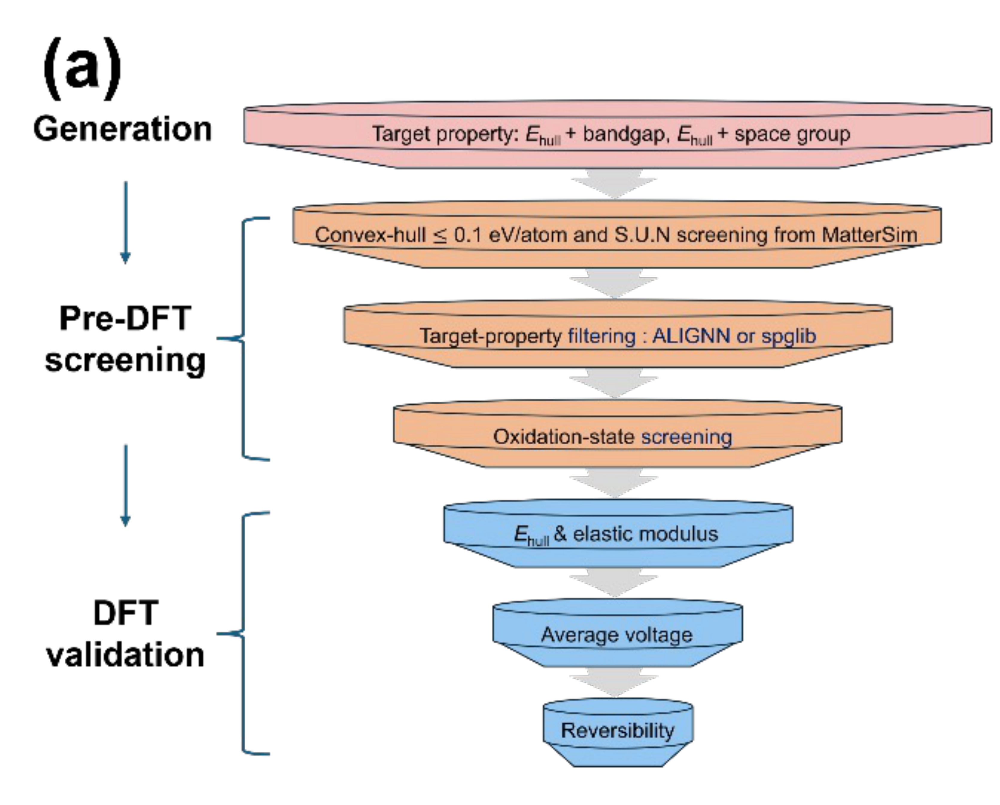

# First-Principles Screening of Fluoride-Ion Battery Materials

This repository contains crystal structures generated and screened for the discovery of candidate materials for fluoride-ion batteries (FIBs).

## Screening Workflow



Candidate structures were generated using MatterGen and subsequently screened through multiple stages based on composition, predicted electronic properties, chemical criteria, oxidation states, and DFT calculations.

## Repository Structure

```text
.
├── alex-mp-20/
│   ├── README.txt
│   ├── RED/
│   ├── ORANGE/
│   ├── YELLOW/
│   ├── GREEN/
│   ├── BLUE/
│   └── NAVY/
│
├── structures/
│   └── final_candidate/
│
├── figures/
│   └── screening_workflow.png
│
└── README.md
```

## Methods and Software

The screening workflow employs the following datasets and computational tools:

- **Alex-MP-20**  
  Used as the source dataset for materials screening.

- **MatterGen**  
  Used for generative materials exploration.

- **MatterSim**  
  Used for machine-learning-based structural and thermodynamic stability evaluation.

- **ALIGNN (Atomistic Line Graph Neural Network)**  
  Used for machine-learning-based prediction of electronic band gaps.

- **VASP (Vienna Ab initio Simulation Package)**  
  Used for density functional theory (DFT) calculations and validation of the screened candidate structures.

Detailed information on each screening stage and the corresponding intermediate structures is provided in [`alex-mp-20/README.md`](alex-mp-20/README.md) and [`mp-F/README.md`](mp-F/README.md).

---

## References

### MatterGen / Alex-MP-20

1. C. Zeni et al., "A generative model for inorganic materials design," *Nature* (2025).  
   [DOI: 10.1038/s41586-025-08628-5](https://doi.org/10.1038/s41586-025-08628-5)

### MatterSim

2. H. Yang et al., "MatterSim: A Deep Learning Atomistic Model Across Elements, Temperatures and Pressures," *arXiv* (2024).  
   [DOI: 10.48550/arXiv.2405.04967](https://doi.org/10.48550/arXiv.2405.04967)

### ALIGNN

3. K. Choudhary and B. DeCost, "Atomistic Line Graph Neural Network for improved materials property predictions," *npj Computational Materials*, **7**, 185 (2021).  
   [DOI: 10.1038/s41524-021-00650-1](https://doi.org/10.1038/s41524-021-00650-1)

### VASP

4. G. Kresse and J. Furthmüller, "Efficient iterative schemes for ab initio total-energy calculations using a plane-wave basis set," *Physical Review B*, **54**, 11169–11186 (1996).  
   [DOI: 10.1103/PhysRevB.54.11169](https://doi.org/10.1103/PhysRevB.54.11169)

5. G. Kresse and J. Furthmüller, "Efficiency of ab-initio total energy calculations for metals and semiconductors using a plane-wave basis set," *Computational Materials Science*, **6**, 15–50 (1996).  
   [DOI: 10.1016/0927-0256(96)00008-0](https://doi.org/10.1016/0927-0256(96)00008-0)

6. G. Kresse and D. Joubert, "From ultrasoft pseudopotentials to the projector augmented-wave method," *Physical Review B*, **59**, 1758–1775 (1999).  
   [DOI: 10.1103/PhysRevB.59.1758](https://doi.org/10.1103/PhysRevB.59.1758)

---

## License

The data and crystal structures provided in this repository are available for academic and research use.

If you use the data, structures, or results from this repository in your research, please cite the corresponding publication.

Citation information will be updated upon publication of the associated work.
